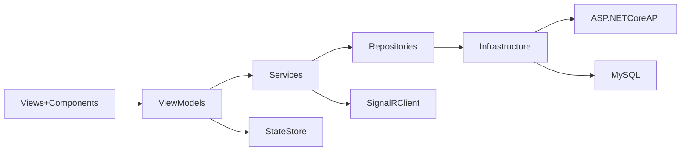

# EnterprisePOS Implementation Roadmap

> Copied from Cursor plan `enterprisepos_roadmap_45971317.plan.md` for version control in this repo.

## Direction and Scope

Build in phases starting with UI foundation + responsive shell + Dashboard + POS (mock/local services first), then integrate API/MySQL/SignalR. This minimizes rework and gives visible progress early.

## Folder Structure Decision

**COMPLETED:** Feature-based modular architecture implemented for scalability and maintainability.

Current structure:

```
EnterprisePOS/
├── Core/                          # Shared infrastructure
│   ├── Models/                   (PosNavItem, DashboardMetric)
│   ├── Validators/               (ValidationResult, IValidator)
│   └── DTOs/                     (UserDto)
│
├── Features/                      # Feature modules
│   ├── POS/                      # Point of Sale module
│   │   ├── Models/               (Product, CartItem, ProductCategory)
│   │   ├── DTOs/                 (ProductDto, CartDto)
│   │   ├── Repositories/         (ProductRepository, CartRepository)
│   │   ├── Services/             (MockPosService)
│   │   ├── Validators/           (ProductValidator)
│   │   ├── ViewModels/           (POSViewModel)
│   │   └── Views/                (POSPage)
│   │
│   ├── Dashboard/                # Dashboard module
│   ├── Products/                 # Products module
│   ├── Inventory/                # Inventory module
│   └── Settings/                 # Settings module
│
├── Interfaces/                   # Base interfaces
├── Repositories/                 # Base repository (InMemoryRepository)
├── Services/                     # Shared services (ThemeService, LoggingService, ShellNavigationService)
├── Components/                   # Reusable UI components
├── Helpers/                      # Utility classes
├── Navigation/                   # Navigation service
├── Themes/                       # Theme management
└── Configurations/                # App configuration
```

## Target Architecture



## Immediate Implementation Checklist (Phase 1)

1. **Foundation setup (MVVM-first)**
   - Introduce base abstractions (`BaseViewModel`, `INavigationService`, `IApiService`, `IRepository<T>`)
   - Register services/viewmodels in DI from [`MauiProgram.cs`](../MauiProgram.cs)
   - Replace code-behind interactions in pages with commands/properties

2. **Responsive Shell and navigation system**
   - Rework [`AppShell.xaml`](../AppShell.xaml) to support:
     - Desktop/tablet: sidebar (Flyout)
     - Mobile: bottom tabs for primary modules
   - Add centralized routes in `Navigation/Routes.cs`

3. **Theme system and design tokens**
   - Move from basic style files to semantic tokens in [`Resources/Styles/Colors.xaml`](../Resources/Styles/Colors.xaml) and [`Resources/Styles/Styles.xaml`](../Resources/Styles/Styles.xaml)
   - Add Light/Dark dictionaries and runtime theme switching service
   - Standardize spacing, radius, shadows, and typography tokens

4. **Core reusable UI components**
   - Create `Components/` controls: metric card, section header, searchable list toolbar, empty-state, primary action button
   - Ensure touch-friendly minimum sizes for tablet POS terminals

5. **Dashboard + POS initial module slice**
   - Replace template [`MainPage.xaml`](../MainPage.xaml) with role-ready dashboard shell page
   - Add `Views/DashboardPage.xaml` + `DashboardViewModel`
   - Add `Views/POSPage.xaml` + `POSViewModel` with:
     - product grid, category filter, search, cart summary, checkout panel
     - mock service-backed async data loading

## Phase 2 (Business Modules UI Skeleton)

- Add navigation-ready pages + viewmodels for:
  - Products, Inventory, Booking, Customers, Reports, Users/Roles, Notifications, Logs, Settings, Branches, Payments
- Add role/permission-ready menu visibility model
- Introduce shared list/detail page templates

## Phase 3 (Data and Integration Layer)

- API-first contracts (`DTOs/`, `Interfaces/`, mappers)
- ASP.NET Core API client setup with auth token pipeline
- Repository implementations backed by API + local cache fallback
- MySQL-ready backend contract alignment

## Phase 4 (Realtime, Offline, Hardware)

- SignalR event channels (inventory changes, dashboard activity, order updates)
- Offline queue/sync strategy for POS transactions
- Hardware adapter interfaces for barcode, thermal printer, cash drawer, QR

## Phase 5 (Hardening and Enterprise Readiness)

- Validation framework + global error handling + logging pipeline
- Performance passes (paging, lazy loading, virtualization-ready lists)
- Accessibility and touch ergonomics review
- Cross-device QA matrix (Windows, Android phone/tablet, iOS, MacCatalyst)

## Definition of Done Per Module

- MVVM bindings only (no business logic in code-behind)
- Responsive layouts for desktop/tablet/mobile
- Themed with semantic tokens only (no hardcoded colors)
- Async service calls with loading/error/empty states
- Navigation and permission hooks prepared

## Execution Order

- Sprint 1: Foundation + AppShell responsive + theme tokens
- Sprint 2: Dashboard + POS (mock data)
- Sprint 3: Remaining module skeletons + reusable components expansion
- Sprint 4: API/MySQL integration + auth + repositories
- Sprint 5: SignalR/offline/hardware adapters + optimization

## Current Progress Snapshot

| Area | Status |
|------|--------|
| MVVM + DI foundation | Done (base classes, mock services) |
| Feature-based modular architecture | Done (Core/, Features/, POS, Dashboard, Products, Inventory, Settings) |
| POS module (tablet/laptop layout) | Done — sidebar, catalog, cart panel, mobile cart overlay |
| Responsive breakpoint (~900px) | Done on `POSPage` |
| Dashboard | Done — DashboardPage, DashboardHomePage, DashboardViewModel, MockDashboardService |
| Settings | Done — SettingsPage, SettingsViewModel |
| Products | Done — ProductsPage (skeleton) |
| Inventory | Done — InventoryPage (skeleton) |
| Database Schema | Done — 70+ tables with complete POS features (see DATABASE_SCHEMA.sql) |
| Database Documentation | Done — DATABASE.md with production deployment guide |
| Offline-First Architecture | Done — Complete implementation guide (OFFLINE_FIRST_IMPLEMENTATION.md) |
| Cross-Platform Design | Done — Responsive design + offline sync architecture (CROSS_PLATFORM_DESIGN.md) |
| Architecture Documentation | Done — ARCHITECTURE.md updated with database reference |
| Semantic `Themes/` dictionaries | In repo; excluded from build until safe merge |
| Flyout / bottom tabs shell | Planned (Sprint 1) |
| API / MySQL / SignalR | Phase 3–4 |
| Windows portable publish | Documented — see [PUBLISH_WINDOWS.md](PUBLISH_WINDOWS.md) |
| Windows MSIX installer | Script [`publish-msix.ps1`](../publish-msix.ps1) + [PUBLISH_WINDOWS.md](PUBLISH_WINDOWS.md) |

## Completed Work (Latest)

### Database Schema (70+ Tables)
- Core System (users, roles, permissions, branches, terminals)
- Products & Inventory (with unit conversion, serial tracking, batch tracking)
- Sales & Payments (with add-ons, discounts, taxes, refunds)
- Delivery Operations (addresses, drivers, orders, tracking)
- Dine-In Operations (tables, reservations)
- Kitchen Display System (stations, orders, items)
- Customer Management (loyalty, gift cards, feedback, groups, tax exemptions)
- Marketing (promotions, notification templates)
- Employee Management (schedules, commissions)
- Advanced Features (transfers, warehouses, multi-currency, appointments, returns)
- Developer Tools (branding, version tracking, licenses, API integrations)
- Reporting (daily sales, product performance, inventory valuation)

### Documentation
- **DATABASE.md** - Complete database documentation with production deployment guide
- **OFFLINE_FIRST_IMPLEMENTATION.md** - Comprehensive offline-first implementation guide
- **CROSS_PLATFORM_DESIGN.md** - Cross-platform design with offline sync architecture
- **ARCHITECTURE.md** - Updated with database reference
- **DATABASE_SCHEMA.sql** - Complete SQL schema with sample data

## Next Steps (Priority Options)

### Option 1: Continue with POS module enhancements
- Refactor MockPosService to use repositories
- Add search functionality to products
- Add category filtering
- Add product image loading

### Option 2: Implement Dashboard module
- Add real KPI widgets
- Add sales charts
- Add realtime activity feed
- Connect to actual data

### Option 3: Implement Products module
- Add product CRUD operations
- Add product list view
- Add product detail view
- Add product form with validation

### Option 4: Implement Inventory module
- Add stock level tracking
- Add inventory alerts
- Add stock adjustment functionality
- Add transfer functionality

### Option 5: Implement Settings module
- Add more settings options
- Add theme customization
- Add user preferences
- Add system configuration

### Option 6: Add new feature modules
- Customers module
- Reports module
- Users/Roles module
- Booking module

## Windows packaging (desktop)

Full step-by-step instructions (dev run, portable folder, MSIX, cert trust, troubleshooting): **[PUBLISH_WINDOWS.md](PUBLISH_WINDOWS.md)**

Quick reference:

| Goal | Command |
|------|---------|
| Live preview (auto rebuild on save) | `.\watch.ps1` |
| Run during development (one-off) | `.\run.ps1` |
| XAML Hot Reload (fastest UI) | Visual Studio F5 — see [PUBLISH_WINDOWS.md](PUBLISH_WINDOWS.md) |
| Portable Release folder | `dotnet publish -c Release -f net10.0-windows10.0.19041.0 -p:WindowsPackageType=None` |
| Signed MSIX installer | `.\publish-msix.ps1` |

`WindowsPackageType` stays **`None`** in the project file for normal builds; MSIX is enabled only at publish time so Debug/dev workflows stay stable.